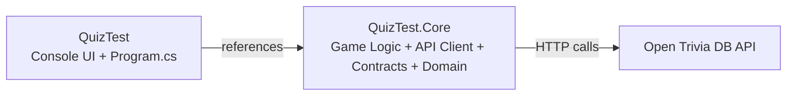

# QuizTest

> This project is a concept demo intended for students to explore before an upcoming lab. It serves as a reference for how a small .NET console application can be structured using interfaces, dependency injection, and external APIs.

A console-based multiple-choice quiz game built with .NET 10, powered by the [Open Trivia Database](https://opentdb.com) API and rendered with [Spectre.Console](https://spectreconsole.net).

The solution is split into:

- `QuizTest.Core` for game logic, contracts, domain models, API integration, and DI registration.
- `QuizTest` for console UI and app composition.

## Features

- Select difficulty: easy, medium, or hard
- Choose number of questions: 5, 10, 15, or 20
- Browse and filter by quiz category
- Randomized answer order per question
- Immediate feedback after each answer
- Final score summary with percentage

## Requirements

- [.NET 10 SDK](https://dotnet.microsoft.com/download)

## Getting Started

```bash
git clone <repo-url>
cd QuizTest
dotnet run --project src/QuizTest
```

## Running Tests

```bash
dotnet test
```

## Dependency Injection

Core service registration is exposed through an extension method:

```csharp
services.AddQuizCore();
```

Optional overrides:

```csharp
services.AddQuizCore(
    apiBaseUrl: "https://opentdb.com",
    apiTimeout: TimeSpan.FromSeconds(30));
```

## Architecture

Dependency direction:



Runtime flow:

- `Program.cs` builds the DI container.
- `AddQuizCore()` registers core services (`IQuizApiClient`, `IAnswerShuffler`, `QuizGame`).
- UI registers `IQuizUi` with `SpectreQuizUi`.
- `QuizGame` orchestrates gameplay through contracts and domain models in `QuizTest.Core`.

## Project Structure

```zsh
src/
  QuizTest.Core/
    Contracts/       # Interfaces (IQuizApiClient, IQuizUi, IAnswerShuffler)
    DependencyInjection/ # IServiceCollection extensions (AddQuizCore)
    Domain/          # Domain models (QuizQuestion, QuizCategory)
    Integrations/    # OpenTrivia API response models
    Services/        # Core game logic and answer shuffling
    QuizApiClient.cs # HTTP client for Open Trivia API
  QuizTest/
    Services/        # UI implementation (Spectre.Console, QuizTest.Ui.Services)
    Program.cs       # Entry point and DI composition
tests/
  QuizTest.Tests/    # xUnit tests with Moq
```

## Tech Stack

- **Framework:** .NET 10
- **UI:** Spectre.Console
- **DI:** Microsoft.Extensions.DependencyInjection
- **Testing:** xUnit, Moq, Coverlet
- **API:** [Open Trivia Database](https://opentdb.com)
